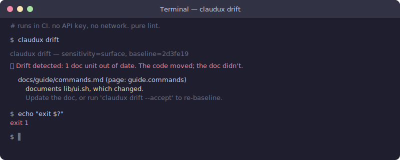

<p align="center">
  
</p>

<p align="center">
  <a href="https://www.npmjs.com/package/claudux"></a>
  <a href="https://www.npmjs.com/package/claudux"></a>
  <a href="https://github.com/firstbitelabsllc/claudux/actions/workflows/ci.yml"></a>
  <a href="https://github.com/firstbitelabsllc/claudux/stargazers"></a>
  <a href="LICENSE"></a>
  
</p>

# claudux

## Your build fails the moment a doc starts lying.

You changed a function. A doc three folders away now describes code that no longer exists. Nothing told you, and the next reader trusts it. claudux catches that in CI and fails the build the moment a doc falls behind the code it describes.

## Why this exists

Anyone can generate docs now. Models do it for free, so "AI wrote my docs" proves nothing. The problem starts a week later. You ship a change, and every doc that described the old behavior quietly goes wrong. No test fails. No reviewer notices. The lie sits there until someone acts on it.

Increasingly that someone is an agent. It reads your API doc to decide how to call you, trusts it, and writes a plan on top of it. A wrong doc isn't a nuisance anymore. It's a confident lie an agent ships.

Think of the drift baseline as a package-lock for your docs: committed to the repo, checked on every build. Generating the docs is table stakes. Proving they still match is the hard part.

## See it catch a lie

<p align="center">
  
</p>

That is the same commit that made the doc wrong. The build is red before anyone merges it.

## How claudux compares

| | claudux | TypeDoc / JSDoc | Docusaurus | Manual docs |
|---|---|---|---|---|
| **Staleness check** | `claudux drift` fails CI, keyless | None | None | None |
| **Input** | Source code, existing docs, optional manifest | Type annotations and comments | Hand-written docs | Hand-written docs |
| **Output** | VitePress site | API reference | Static docs site | Any format |
| **Maintenance** | Re-run `claudux update` | Rebuild on code change | Edit by hand | Edit by hand |
| **AI backend** | Claude or Codex CLI | None | None by default | None |
| **Link validation** | Built in | Generator-specific | Build-time | Manual |
| **Structure guardrails** | Manifest, pinned sections, bounded patches | No | Config-owned navigation | Manual review |

The staleness-check row is the whole argument. Everything else is table stakes.

## Install

**Run the drift gate.** It ships in source (1.2.0). npm still serves 1.1.1, which has no `claudux drift`, so install from source until the 1.2.0 publish lands:

```bash
npm i -g firstbitelabsllc/claudux
# or: git clone https://github.com/firstbitelabsllc/claudux.git && cd claudux && npm link
```

**Generate docs.** The generator is on npm today:

```bash
npm install -g claudux
```

Requirements: Node 18+. Generation needs an authenticated Claude CLI (default) or Codex CLI on the machine; there is no hosted API key path. The drift gate needs neither. It is keyless and runs offline.

## Quick start

```bash
cd your-project

claudux update   # generate or update the VitePress docs
claudux serve    # preview the site locally
claudux drift    # fail if a documented function changed but its doc didn't
```

Commit the baseline once with `claudux drift --accept`, then let CI run the drift gate on every push. (`drift` needs the source install above until 1.2.0 is on npm.)

## The drift gate

This is the part nothing else does. The drift gate catches a stale doc on the commit that made it stale, not from a reader three weeks later.

It is deterministic: parse, hash, compare, exit code. No API key, no network, no model on the pass/fail path, so it runs offline in CI and never flakes. The manifest (`docs-structure.json`) already records which source each doc section describes. `claudux drift` reads a committed baseline (`docs-drift-lock.json`) and fails when a covered source moved while its doc stood still. When it flags drift it names the doc, the source that changed, and the fix.

```bash
claudux drift             # human report, exit 1 on drift (the CI gate)
claudux drift --json      # machine-readable report for tooling
claudux drift --warn-only # exit 0 even when drift is found (local pre-commit advisory)
claudux drift --accept    # re-baseline after you update the docs (no AI)
```

Exit 0 means clean or no baseline yet. Exit 1 means drift. Exit 2 means an error.

Commit the baseline once with `claudux drift --accept`, then drop this in `.github/workflows/docs-drift.yml`:

```yaml
name: Docs drift
on: [push, pull_request]
jobs:
  drift:
    runs-on: ubuntu-latest
    steps:
      - uses: actions/checkout@v4
      - uses: actions/setup-node@v4
        with: { node-version: 18 }
      - run: npm i -g firstbitelabsllc/claudux   # source install until 1.2.0 is on npm; then: npx claudux drift
      - run: claudux drift
```

No secrets. The check is pure lint.

A sensitivity knob (`drift_sensitivity`) sets how much churn counts as drift. `significant` (default) ignores comment, blank, and whitespace churn and fires on renamed flags, changed defaults, and changed logic. `raw` hashes the whole file. `surface` (shell repos) tracks only exported function and command names.

## What else it does

**Generation.** `claudux update` drafts a full VitePress docs site straight from your code, so you start from a real draft instead of an empty `docs/` folder. It uses your authenticated Claude CLI by default (Sonnet); set `CLAUDUX_BACKEND=codex` for the Codex CLI (gpt-5.4). It is not an API-reference generator, so pair it with TypeDoc or JSDoc if you need one. Model output can be wrong; link checks and manifests shrink the blast radius, they do not replace review.

**Audit.** `claudux audit` prints a no-AI readiness snapshot: project detection, manifest validity, link status, checkpoint freshness, changed files since checkpoint, and uncommitted docs or config. `--json` makes it machine-readable for CI and agent handoffs.

**Deterministic manifest mode.** A committed `docs-structure.json` owns page structure and declares which source files each doc section describes. claudux applies bounded section patches instead of broad rewrites, and guards content through skip markers and path denylists.

## How it works

- The repo owns structure. `docs-structure.json` holds page IDs, navigation order, and which source each section describes, so the model rewrites wording and never reorganizes your docs.
- Generation is bounded. claudux applies validated section patches, so a regen touches the sections that changed instead of rewriting whole pages.
- Your content stays put. Pinned sections, read-only sections, and skip-marker blocks are hashed before and after generation, so protected text cannot change silently.
- The checks are keyless. `serve`, `status`, `diff`, `validate`, `audit`, and `drift` never call a backend, so they run in CI with no key and no network. Only `update`, `recreate`, `template`, and the interactive menu call the model.

## Commands

```bash
claudux                 # Interactive menu
claudux update          # Generate or update docs
claudux update -m "..." # Update with a focused directive
claudux serve           # Start the VitePress dev server
claudux drift           # Fail CI when documented code changed but its doc did not
claudux drift --accept  # Re-baseline the drift lock (no AI)
claudux audit           # No-AI readiness report for CI and agent handoffs
claudux audit --release # Fail on docs/package release-readiness drift
claudux status          # Show documentation freshness
claudux diff            # Show files changed since the last checkpoint
claudux validate        # Validate manifest and internal links
claudux check           # Verify Node, backend CLI, and docs state
claudux template        # Generate claudux.md preferences
claudux recreate        # Delete docs and regenerate, unless the manifest guard blocks it
```

`claudux diff` and `claudux status` read `.claudux-state.json`, which is local per developer and ignored by git.

## Configuration

Optional `claudux.json` in the project root:

```json
{
  "project": {
    "name": "Your Project",
    "type": "react"
  }
}
```

- `claudux.json` sets project metadata and type overrides.
- `claudux.md` stores documentation preferences generated by `claudux template`.
- `docs-structure.json` is the deterministic manifest for pinned pages, source-owned sections, bounded patching, and deletion guards.
- `docs-drift-lock.json` is the committed drift baseline; regenerate it with `claudux drift --accept` or `claudux update`.

claudux auto-detects iOS, Next.js, React, Node.js, JavaScript, Java, Python, Go, and Rust. Anything else falls back to a generic profile, or set `project.type` in `claudux.json`.

## Content protection

claudux never writes to protected paths: `notes/`, `private/`, `.git/`, `node_modules/`, `vendor/`, `target/`, `build/`, and `dist/`. Use skip markers to protect specific blocks:

```markdown
<!-- skip -->
This block is preserved by claudux.
<!-- /skip -->
```

Language-specific pairs are supported, including `// skip`, `# skip`, `/* skip */`, and `-- skip`. In deterministic mode, skip-marker hashes are captured in the guard snapshot so protected blocks cannot change silently during generation.

## Project docs

- [Live docs](https://firstbitelabsllc.github.io/claudux/)
- [Architecture](./ARCHITECTURE.md)
- [Deterministic generation](./docs/technical/deterministic-generation.md)
- [Changelog](./CHANGELOG.md)
- [Security](./SECURITY.md)
- [Contributing](./CONTRIBUTING.md)

## License

MIT
