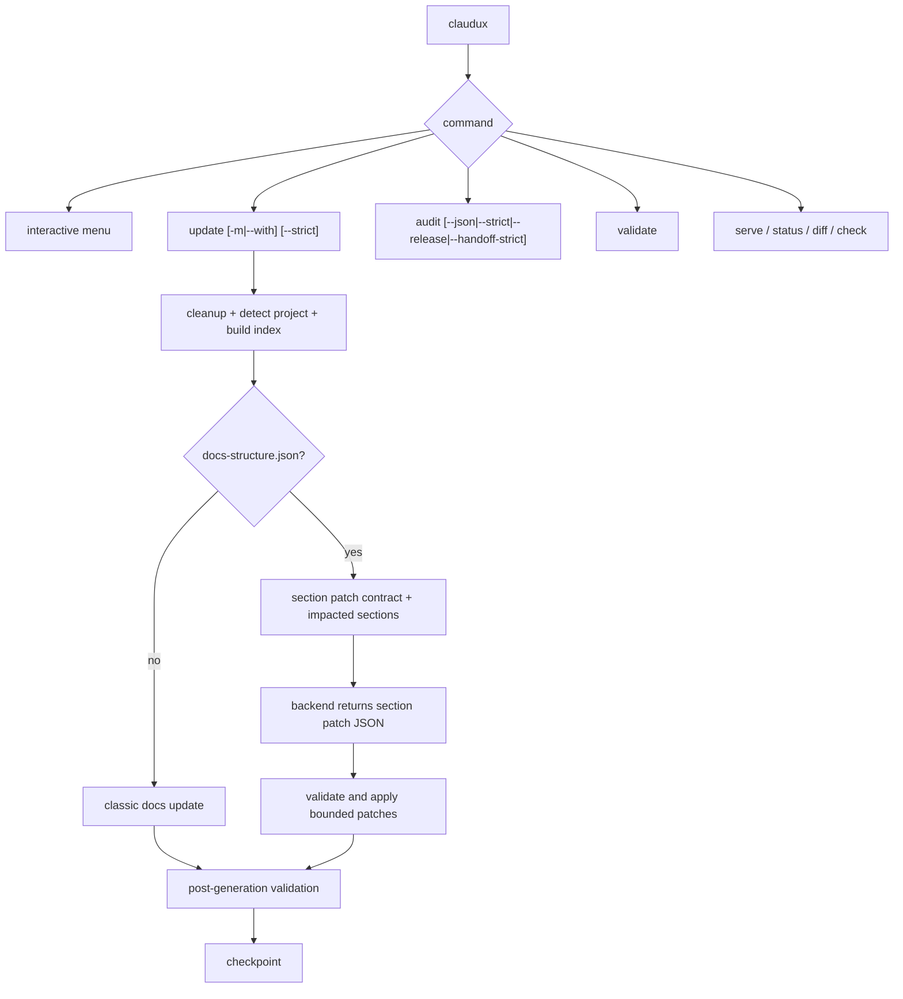

<p align="center">
  
</p>

<p align="center">
  <a href="https://www.npmjs.com/package/claudux"></a>
  <a href="https://www.npmjs.com/package/claudux"></a>
  <a href="https://github.com/firstbitelabsllc/claudux/actions/workflows/ci.yml"></a>
  <a href="https://github.com/firstbitelabsllc/claudux/stargazers"></a>
  <a href="LICENSE"></a>
  
</p>

# claudux

Claudux is a CLI that keeps your docs true to your code. It generates VitePress docs, then checks in CI that they still match the code they describe. Generation uses Claude by default, or Codex with `CLAUDUX_BACKEND=codex`. The drift check uses no AI at all.

**Canonical home:** [github.com/firstbitelabsllc/claudux](https://github.com/firstbitelabsllc/claudux) · **Docs:** [firstbitelabsllc.github.io/claudux](https://firstbitelabsllc.github.io/claudux/) · **npm:** [`claudux`](https://www.npmjs.com/package/claudux)

Current source also supports deterministic docs mode: when a repository checks in `docs-structure.json`, claudux treats the docs tree as source-owned state, builds a static analysis index before model invocation, and applies model output through bounded section patches instead of broad rewrites.

> **See it in action:** [Live documentation](https://firstbitelabsllc.github.io/claudux/) (generated by claudux itself)

## Why this exists

Anyone can generate docs now. The problem is proving they still match the code a week later. That gets worse as agents become the primary readers of your docs — a stale doc stops being a minor annoyance and becomes a confident lie that breaks the agent's plan.

Claudux checkpoints which code each doc section describes, then flags the sections that fell behind. Your repo owns structure and protected sections; an authenticated Claude or Codex CLI only proposes wording for the pages you decided matter. The staleness check that runs in CI is deterministic — parse, hash, compare, exit code. No API key, no network, no model on the pass/fail path.

## Limits

- Needs an authenticated **Claude** or **Codex** CLI on the machine that runs `claudux update`. No hosted API key path is built in.
- `npm install -g claudux` currently installs **npm 1.1.1**. This repository’s `package.json` is **1.2.0** (deterministic docs + audits). Until a tagged npm publish lands, treat npm as the stranger install and `main` as source-ahead.
- Not an API-reference generator (use TypeDoc/JSDoc alongside it if you need that).
- Model output can still be wrong; link validation and manifests reduce blast radius, they do not replace review.

## Install

```bash
npm install -g claudux
claudux --version   # expect 1.1.1 from npm today
```

To run **source 1.2.0** before the next publish:

```bash
git clone https://github.com/firstbitelabsllc/claudux.git
cd claudux && npm link
claudux --version   # expect 1.2.0 from this tree
```

Requirements:

- Node.js >= 18
- An authenticated AI CLI:
  - Claude CLI for the default backend
  - Codex CLI for `CLAUDUX_BACKEND=codex`

Claudux runs as a local shell tool. The selected AI CLI still receives the prompt context claudux gives it, according to that backend's own authentication, transport, and data handling behavior.

## Quick Start (90 seconds)

```bash
cd your-project

# Generate or update docs.
claudux update

# Preview the VitePress site.
claudux serve

# Validate generated docs without regenerating.
claudux validate
```

Use a focused directive when you know what changed:

```bash
claudux update -m "Document the new authentication flow"
claudux update --with "Refresh CLI command docs from bin/claudux"
```

### Demo

<p align="center">
  
</p>

## How It Works

Claudux is command-first: most commands inspect or serve local docs, and only `update`, `template`, or the interactive menu need an AI backend.



Deterministic mode is meant for larger repos where the structure of the documentation is part of the product:

- `docs-structure.json` owns page IDs, paths, navigation order, source ownership, deletion policy, and required sections.
- `.claudux/index/static-analysis.json` records sorted, hash-based facts about tracked source files, docs files, package scripts, shell dependencies, headings, links, and manifest ownership.
- `.claudux/index/impacted-docs.json` maps changed files through manifest `source_patterns` and dependency edges to the docs that may be stale.
- The model returns JSON between `CLAUDUX_SECTION_PATCHES_JSON_START` and `CLAUDUX_SECTION_PATCHES_JSON_END`.
- Claudux applies only validated patches to manifest-owned generated sections.
- Pinned sections, read-only sections, and skip-marker blocks are guarded before and after generation.
- AI cleanup paths and `claudux recreate` are blocked from deleting manifest-owned docs unless explicitly unlocked with environment overrides.

The model can propose wording. The repository owns structure.

For team-agent handoffs and CI checks, `claudux audit` provides a no-AI readiness snapshot. It reports project detection, manifest validity, link status, checkpoint freshness, changed files since checkpoint, and uncommitted docs/config changes; `--json` makes the same report machine-readable.

## Backends

| Backend | Select with | CLI required | Notes |
|---------|-------------|--------------|-------|
| Claude | default or `CLAUDUX_BACKEND=claude` | `claude` | Default backend. Uses `FORCE_MODEL=sonnet` unless overridden. |
| Codex | `CLAUDUX_BACKEND=codex` | `codex` | Supported backend. Defaults to `gpt-5.4` with `xhigh` reasoning. |

```bash
# Default: Claude
claudux update

# Codex
CLAUDUX_BACKEND=codex claudux update

# Codex settings
export CLAUDUX_BACKEND=codex
export CODEX_MODEL=gpt-5.4
export CODEX_REASONING_EFFORT=xhigh
claudux update
```

Codex runs through `codex exec --json` with `approval_policy="never"`. Its default sandbox is `danger-full-access`; when claudux enters manifest section-patch mode, it requests a read-only sandbox unless `CODEX_SANDBOX_MODE` is set.

## Commands

```bash
claudux                 # Interactive menu
claudux update          # Generate or update docs
claudux update -m "..." # Update with a focused directive
claudux update --strict # Fail if internal links remain broken
claudux serve           # Start the VitePress dev server
claudux diff            # Show files changed since the last checkpoint
claudux status          # Show documentation freshness
claudux audit           # Print a no-AI readiness report for humans, CI, and agents
claudux audit --release # Fail docs/package release-readiness drift
claudux drift           # Fail CI when documented code changed but its doc did not
claudux drift --accept  # Re-baseline the drift lock after you update the docs
claudux validate        # Validate manifest and internal links
claudux check           # Verify Node, backend CLI, and docs state
claudux template        # Generate claudux.md preferences
claudux recreate        # Delete docs and regenerate, unless manifest guard blocks it
claudux --version       # Show installed version
claudux --help          # Show help
```

`claudux diff` and `claudux status` read `.claudux-state.json`, which is local per developer and ignored by git.

## Drift gate

`claudux drift` fails your build when a documented function changes but its doc doesn't. It is deterministic: parse, hash, compare, exit code. No API key, no network, no model on the pass/fail path — it runs offline in CI.

The manifest (`docs-structure.json`) already records which source files each doc page and section describes. `claudux drift` reads a committed baseline, `docs-drift-lock.json`, and fails when a covered source changed since the baseline while its doc did not.

```bash
claudux drift             # human report, exit 1 on drift (the CI gate)
claudux drift --json      # machine-readable report for tooling
claudux drift --warn-only # always exit 0 (local pre-commit advisory)
claudux drift --accept    # re-baseline after you update the docs (no AI)
```

When it flags drift, it names the doc, the source that moved, and the fix — update the doc, or run `claudux drift --accept` to freeze a new baseline. AI stays where it always was: in generation, and only ever *suggesting* a fix *after* the deterministic flag.

A sensitivity knob (`drift_sensitivity` in the manifest) trades signal for strictness: `significant` (default) ignores comment/blank/reindent churn and fires on renamed flags, changed defaults, and changed logic; `raw` hashes the whole file; `surface` (shell repos) tracks only exported function and command names.

### Add to CI

Commit the lock once (`claudux drift --accept`), then drop this in `.github/workflows/docs-drift.yml`:

```yaml
name: Docs drift
on: [push, pull_request]
jobs:
  drift:
    runs-on: ubuntu-latest
    steps:
      - uses: actions/checkout@v4
      - uses: actions/setup-node@v4
        with: { node-version: 18 }
      - run: npx claudux drift
```

No secrets, no API key — the check is pure lint. For a local pre-commit advisory, run `claudux drift --warn-only`.

## Configuration

Optional `claudux.json` in the project root:

```json
{
  "project": {
    "name": "Your Project",
    "type": "react"
  }
}
```

Common config files:

- `claudux.json` sets project metadata and type overrides.
- `claudux.md` stores documentation preferences generated by `claudux template`.
- `docs-structure.json` is the deterministic manifest for repos that want pinned pages, source-owned sections, bounded patching, and deletion guards.
- `docs-drift-lock.json` is the committed drift baseline read by `claudux drift`; regenerate it with `claudux drift --accept` or `claudux update`.

Claudux auto-detects common project types from repo files, including React, Next.js, JavaScript, Node.js, Python, Go, iOS, Android, Rust, Rails, and Flutter.

## Content Protection

Claudux automatically protects sensitive paths such as `notes/`, `private/`, `.git/`, `node_modules/`, `*.env`, `*.key`, and `*.pem`.

Use skip markers to protect specific blocks:

```markdown
<!-- skip -->
This block is preserved by claudux.
<!-- /skip -->
```

Language-specific marker pairs are supported for common source files, including `// skip`, `# skip`, `/* skip */`, and `-- skip`.

In deterministic mode, skip-marker hashes are captured in the guard snapshot so protected blocks cannot be changed silently during generation.

## How Claudux Compares

| | Claudux | TypeDoc / JSDoc | Docusaurus | Manual docs |
|---|---|---|---|---|
| **Input** | Source code, existing docs, optional manifest | Type annotations and comments | Hand-written docs | Hand-written docs |
| **Output** | VitePress site | API reference | Static docs site | Any format |
| **Maintenance** | Re-run `claudux update` | Rebuild on code change | Edit by hand | Edit by hand |
| **AI backend** | Claude or Codex CLI | None | None by default | None |
| **Link validation** | Built in | Generator-specific | Build-time | Manual |
| **Structure guardrails** | Optional manifest, pinned sections, bounded patches | No | Config-owned navigation | Manual review |

Claudux is not an API reference generator. It is designed for guides, architecture pages, command references, and source-aware maintenance docs. It can run alongside TypeDoc, JSDoc, or other reference generators.

## Project Docs

- [Live docs](https://firstbitelabsllc.github.io/claudux/)
- [Architecture](./ARCHITECTURE.md)
- [Deterministic generation](./docs/technical/deterministic-generation.md)
- [Changelog](./CHANGELOG.md)
- [Security](./SECURITY.md)
- [Contributing](./CONTRIBUTING.md)

## Studio note

Claudux is open source under MIT, maintained in the **First Bite Labs** GitHub org. First Bite Labs also ships private consumer products (for example Resplit). Those products are **not** open source. A related private control-plane experiment for multi-session AI coding work is intentionally **not** published as a public product; claudux stays useful without it. When claudux detects `vidux.config.json` or a root `PLAN.md` with `projects/*/PLAN.md`, it can use a plan-aware template so team plans and verification gates become documentation inputs.

## License

MIT
