<p align="center">
  
</p>

<p align="center">
  <a href="https://github.com/firstbitelabsllc/claudux/actions/workflows/ci.yml"></a>
  <a href="https://github.com/firstbitelabsllc/claudux/stargazers"></a>
  <a href="LICENSE"></a>
  
</p>

# claudux

Generate a VitePress docs site from your codebase, preview it locally, and update it in place as the code changes.

claudux scans your code and drafts a full VitePress docs site with your authenticated Claude CLI (or Codex CLI). It is not a free-writing model pass: the repo owns the structure, generation applies bounded section patches, protected content is hashed before and after, and internal links are validated on every update.

## Why this exists

Anyone can ask a model to write docs. The hard part is keeping the model on rails: not reorganizing your navigation, not rewriting sections that didn't change, not touching content you marked as yours. claudux puts those rails in the repo — a committed manifest owns page structure, skip markers protect blocks, and link validation catches 404s before your readers do.

## Install

claudux installs straight from GitHub — no npm account, no registry. The script clones the repo into `~/.local/share/claudux` and symlinks `bin/claudux` onto your PATH:

```bash
curl -fsSL https://raw.githubusercontent.com/firstbitelabsllc/claudux/main/install.sh | sh
```

Or run it once without installing: `npx github:firstbitelabsllc/claudux update`.

This tracks `main`, so you get the latest straight from the repo. Pin a version with `CLAUDUX_REF=v2.0.0`. Re-run it any time to update.

Requirements: Node 18+ and an authenticated Claude CLI (default) or Codex CLI on the machine; there is no hosted API key path.

## Quick start

```bash
cd your-project

claudux update   # generate or update the VitePress docs
claudux serve    # preview the site locally
```

Run `claudux` with no arguments for an interactive menu.

<p align="center">
  
</p>

Every line above is from a real run against a two-file Node CLI — detection, generation, link validation, and the VitePress preview.

## What it does

**Generation.** `claudux update` drafts a full VitePress docs site straight from your code, so you start from a real draft instead of an empty `docs/` folder. It uses your authenticated Claude CLI by default (Sonnet); set `CLAUDUX_BACKEND=codex` for the Codex CLI (gpt-5.4). It is not an API-reference generator, so pair it with TypeDoc or JSDoc if you need one. Model output can be wrong; link checks and manifests shrink the blast radius, they do not replace review.

**Deterministic manifest mode.** A committed `docs-structure.json` owns page structure and declares which source files each doc section describes. claudux applies bounded section patches instead of broad rewrites, and guards content through skip markers and path denylists.

**Link validation.** Every update validates internal links and fails loudly on broken ones. Pass `--strict` to make broken links a hard failure.

**Focused updates.** `claudux update -m "document the new auth flow"` steers a regeneration at one area instead of the whole site.

## How it works

- The repo owns structure. `docs-structure.json` holds page IDs, navigation order, and which source each section describes, so the model rewrites wording and never reorganizes your docs.
- Generation is bounded. claudux applies validated section patches, so a regen touches the sections that changed instead of rewriting whole pages.
- Your content stays put. Pinned sections, read-only sections, and skip-marker blocks are hashed before and after generation, so protected text cannot change silently.
- Only `update` and the interactive menu call the model. `serve` and `check` never call a backend.

## Commands

```bash
claudux                 # Interactive menu
claudux update          # Generate or update docs
claudux update -m "..." # Update with a focused directive
claudux serve           # Start the VitePress dev server
claudux check           # Verify Node, backend CLI, and docs state
claudux help            # Show help
claudux --version       # Show installed version
```

## Configuration

Optional `claudux.json` in the project root:

```json
{
  "project": {
    "name": "Your Project",
    "type": "react"
  }
}
```

- `claudux.json` sets project metadata and type overrides.
- `claudux.md` stores optional documentation preferences (navigation order, sections to include or omit, naming policy); claudux reads it when present.
- `docs-structure.json` is the deterministic manifest for pinned pages, source-owned sections, bounded patching, and deletion guards.

claudux auto-detects iOS, Next.js, React, Node.js, JavaScript, Java, Python, Go, and Rust. Anything else falls back to a generic profile, or set `project.type` in `claudux.json`.

## Content protection

claudux never writes to protected paths: `notes/`, `private/`, `.git/`, `node_modules/`, `vendor/`, `target/`, `build/`, and `dist/`. Use skip markers to protect specific blocks:

```markdown
<!-- skip -->
This block is preserved by claudux.
<!-- /skip -->
```

Language-specific pairs are supported, including `// skip`, `# skip`, `/* skip */`, and `-- skip`. In deterministic mode, skip-marker hashes are captured in the guard snapshot so protected blocks cannot change silently during generation.

## Project docs

- [Live docs](https://firstbitelabsllc.github.io/claudux/)
- [Architecture](./ARCHITECTURE.md)
- [Deterministic generation](./docs/technical/deterministic-generation.md)
- [Changelog](./CHANGELOG.md)
- [Security](./SECURITY.md)
- [Contributing](./CONTRIBUTING.md)

## License

MIT
