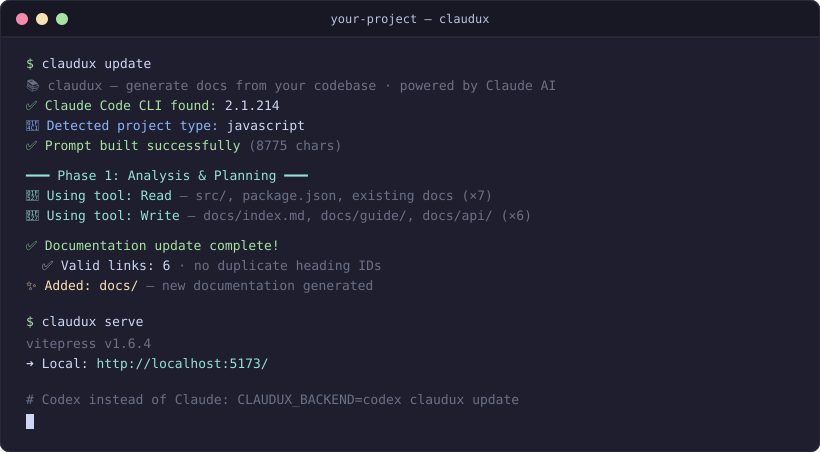

<p align="center">
  
</p>

<p align="center">
  <a href="https://github.com/firstbitelabsllc/claudux/actions/workflows/ci.yml"></a>
  <a href="https://github.com/firstbitelabsllc/claudux/stargazers"></a>
  <a href="LICENSE"></a>
  
</p>

# claudux

Generate a VitePress docs site from your codebase, preview it locally, and update it in place as the code changes.

claudux scans your code and drafts a VitePress docs site with your authenticated Claude CLI or Codex CLI. On a first run, the backend can edit documentation paths directly; claudux snapshots the rest of the Git worktree and rolls back any unrelated file change or commit before failing the run. Commit a `docs-structure.json` to switch to the stricter mode: the backend becomes read-only, returns section-patch JSON, and claudux validates and transactionally applies only the manifest-approved patch batch.

## Why this exists

Anyone can ask a model to write docs. The hard part is controlling what it may change. claudux makes that boundary visible: default generation protects non-documentation paths and leaves the docs diff for review; manifest mode adds section ownership, read-only blocks, transactional patch application, and deterministic local-link checks.

<p align="center">
  
</p>

## Install

claudux installs straight from GitHub — no npm account, no registry. The script clones the repo into `~/.local/share/claudux` and symlinks `bin/claudux` onto your PATH:

```bash
# latest main
curl -fsSL https://raw.githubusercontent.com/firstbitelabsllc/claudux/main/install.sh | sh

# pin the current release
curl -fsSL https://raw.githubusercontent.com/firstbitelabsllc/claudux/v2.0.7/install.sh | CLAUDUX_REF=v2.0.7 sh
```

Or run it once without installing: `npx github:firstbitelabsllc/claudux update`.

Default install tracks `main`. Pin a branch, tag, or commit with `CLAUDUX_REF=<ref>` — a ref that doesn't exist fails the install instead of silently giving you `main`. Re-run it any time to update. Release notes: [v2.0.7](https://github.com/firstbitelabsllc/claudux/releases/tag/v2.0.7).

Requirements: Node 18+ and an authenticated Claude CLI (default) or Codex CLI on the machine; there is no hosted API key path.

## Quick start

```bash
cd your-project

claudux update   # generate or update the VitePress docs
claudux serve    # preview the site locally
```

Run `claudux` with no arguments for an interactive menu.

<p align="center">
  
</p>

Reconstructed from a real claudux run against a two-file Node CLI — detection, generation, link validation, and the VitePress preview.

## What it does

**Generation.** `claudux update` drafts a VitePress docs site from the code and configuration in the current checkout. It uses your authenticated Claude CLI by default; set `CLAUDUX_BACKEND=codex` to use Codex. It is not a deterministic API extractor, and model output can be wrong, so review the generated diff.

**Deterministic manifest mode.** A committed `docs-structure.json` owns page structure and declares which source files each documentation section describes. The backend can only propose JSON patches. claudux validates the full patch batch, stages every target file, verifies that none changed concurrently, and then commits or restores that batch as one transaction.

**Link validation.** After generation, claudux checks VitePress nav and sidebar routes, Markdown links, local assets, generated and explicit anchors, duplicate explicit IDs, path traversal, and symlink escapes. External URLs are skipped. It can attempt one missing-page repair pass; by default unresolved failures warn, while `--strict` makes them fail the update.

**Focused updates.** `claudux update -m "document the new auth flow"` steers a regeneration at one area instead of the whole site.

## How it works

- Default generation is reviewable. The backend may write documentation paths, but claudux rejects and restores changes outside `docs/`, its local state, and documentation-manifest paths.
- Manifest mode is section-bounded. `docs-structure.json` supplies page IDs, source ownership, writable sections, and deletion rules; code, not the backend, applies the patch batch.
- Protected documentation is hash-guarded in manifest mode. Pinned sections, explicit read-only sections, and skip-marker blocks must match the pre-generation snapshot.
- `serve` never invokes a model, though it may scaffold VitePress files and run `npm install`. `check` never generates docs, but it does verify the selected backend's authentication; older Codex CLIs may require a small exec probe when `codex login status` is unavailable.

## Commands

```bash
claudux                 # Interactive menu
claudux update          # Generate or update docs
claudux update -m "..." # Update with a focused directive
claudux serve           # Start the VitePress dev server
claudux check           # Verify Node, backend CLI, and docs state
claudux help            # Show help
claudux --version       # Show installed version
```

## Configuration

Optional `claudux.json` in the project root:

```json
{
  "project": {
    "name": "Your Project",
    "type": "react"
  }
}
```

- `claudux.json` sets project metadata and type overrides.
- `claudux.md` stores optional documentation preferences (navigation order, sections to include or omit, naming policy); claudux reads it when present.
- `docs-structure.json` is the deterministic manifest for pinned pages, source-owned sections, bounded patching, and deletion guards.

claudux auto-detects iOS, Next.js, React, Node.js, JavaScript, Java, Python, Go, and Rust. Anything else falls back to a generic profile, or set `project.type` in `claudux.json` to one of the exact strings: `ios`, `nextjs`, `react`, `nodejs`, `javascript`, `rust`, `python`, `go`, `java`, `generic` — or any type with a template under `lib/templates/` (`flutter`, `android`, and `rails` ship today). An unrecognized value (like `node`) warns and falls back to auto-detection rather than silently degrading to the generic profile.

## Content protection

Protection is strongest with a committed `docs-structure.json`: the backend runs read-only, claudux validates and transactionally applies the manifest section-patch batch, and skip-marker, pinned, and explicit read-only blocks are sha256-hashed in the guard snapshot. Mark blocks like this:

```markdown
<!-- skip -->
This block is hash-guarded by claudux.
<!-- /skip -->
```

Language-specific pairs are supported, including `// skip`, `# skip`, `/* skip */`, and `-- skip`.

Without a manifest, the backend can edit documentation paths directly. `Bash` is disallowed, and claudux also snapshots non-documentation paths plus `HEAD`; if generation changes or commits an unrelated path, the update fails and restores that source state while leaving the generated docs available for review. This is a repository boundary, not section-level protection inside `docs/`. Commit a manifest when individual pages or blocks must be mechanically constrained.

## Project docs

- [Live docs](https://firstbitelabsllc.github.io/claudux/)
- [Architecture](./ARCHITECTURE.md)
- [Deterministic generation](./docs/technical/deterministic-generation.md)
- [Changelog](./CHANGELOG.md)
- [Security](./SECURITY.md)
- [Contributing](./CONTRIBUTING.md)

## License

MIT
