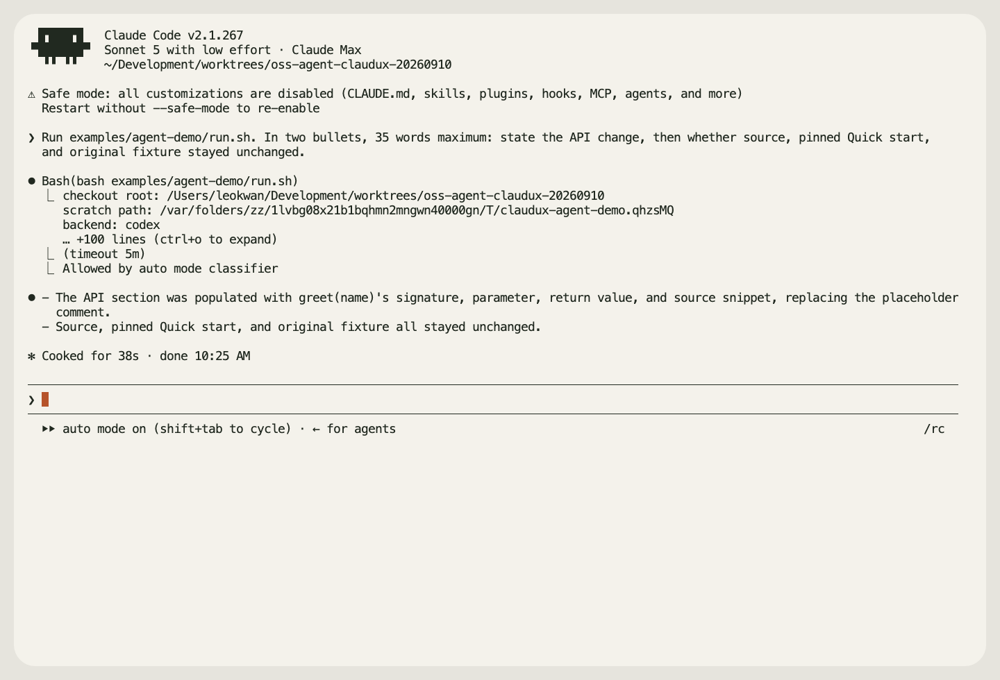

# Claudux

**Update the docs. Keep your words.**

Turn code changes into documentation with Claude Code or Codex. Pin the
sections you wrote. Review what changed.

Claudux builds VitePress documentation using the CLI you are logged into.
Commit a manifest to choose which sections may change and which must stay
byte-for-byte intact. Review the resulting diff before you commit.

[Try it with your coding agent](#try-it-with-your-coding-agent) ·
[Read the guide](https://firstbitelabsllc.github.io/claudux/) ·
[Report a problem](https://github.com/firstbitelabsllc/claudux/issues)



## Try it with your coding agent

Clone the repository, open it in Claude Code or Codex, and send this prompt:

```text
Run examples/agent-demo/run.sh. In two bullets, 35 words maximum: state the API change, then whether source, pinned Quick start, and original fixture stayed unchanged.
```

The helper creates a retained temporary Git project, asks your authenticated
configured coding CLI to document the API section, and proves the source,
pinned Quick start, and original fixture stayed unchanged. It uses your model
allowance. [Watch Claude Code run Claudux with Codex](docs/public/claudux-demo.mp4) or
[read the example details](examples/agent-demo/README.md).

For a deterministic local patcher example with no model call, run:

```bash
git clone https://github.com/firstbitelabsllc/claudux.git
cd claudux
python3 examples/demo.py
```

[Reproduce the authenticated capture](docs/capture.md)

## Use it in your project

Install with Node 18+ and a Claude Code or Codex CLI you are logged into. Tell
your coding agent what changed and what readers need to understand; Claudux
uses the authenticated CLI to prepare the bounded documentation patch.

```bash
curl -fsSL https://raw.githubusercontent.com/firstbitelabsllc/claudux/main/install.sh | sh
cd your-project
claudux check
claudux update -m "Document the API changes in this branch."
claudux serve
```

For a complete, committed example where the configured Codex CLI updates an
API section while a human paragraph remains pinned, see
[`examples/agent-demo`](examples/agent-demo/README.md). The command reference
below is useful when you need a specific CLI option.

`update` uses your model allowance. `serve` opens a local preview.
Before your first update, read the [manifest guide](docs/technical/deterministic-generation.md)
if you want to protect handwritten sections. Without a manifest, the backend
writes documentation directly; it does not infer which paragraphs you meant to keep.

## Give each section a boundary

In a committed `docs-structure.json`, a page can declare:

```json
"sections": [
  { "id": "quick-start", "heading": "Quick start", "level": 2, "pinned": true },
  { "id": "api", "heading": "API", "level": 2, "source_patterns": ["src/**"] }
]
```

In manifest mode the backend returns section patches. Claudux checks targets,
source ownership, headings, and protected hashes before applying the batch.
These checks protect the editing boundary; they cannot establish that the
generated explanation is correct.

A [recorded real update](evidence/real-target-lifecycle.md) documents a new API
while preserving a pinned guide. That receipt includes the model run, a rejected
out-of-bounds write, and the resulting docs build.

## Keep going

[Commands](docs/guide/commands.md) · [Configuration](docs/guide/configuration.md) ·
[Architecture](ARCHITECTURE.md) · [Contributing](CONTRIBUTING.md) ·
[Security](SECURITY.md) · [MIT license](LICENSE)
