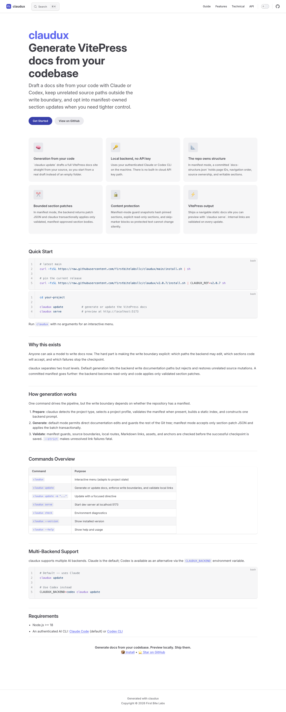
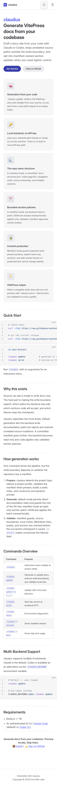

# Claudux Reader Proof

Proof date: 2026-08-27
Candidate base: `085f814`
Browser session: `claudux-reader-c302`

## Verdict

The GitHub README now teaches the problem, product contract, install path,
trust boundary, and one real bounded update without copying the live
documentation homepage. The README and documentation sources pass prose lint,
internal-link validation, the VitePress build, alt-text review, and wide and
phone render checks.

The first browser pass exposed one real defect: the documentation site requested
`/favicon.ico` and received `404`. The candidate now ships
`docs/public/favicon.svg`, and the VitePress config resolves its URL through the
active base path. The final browser pass returns `200 image/svg+xml` with zero
console errors or warnings.

## Deterministic checks

| Surface | Command | Result |
| --- | --- | --- |
| Prose | `vale README.md docs/` | 15 files; zero errors, warnings, or suggestions |
| Internal links and routes | `bash lib/validate-links.sh` | 47 valid, 6 external skipped, zero broken links, zero duplicate heading IDs |
| Static site | `npm --prefix docs run docs:build` | VitePress `1.6.4`; client bundle, server bundle, and page rendering passed |

## Alt-text audit

The README contains seven images. Each now has an explicit accessible name:

| Image | Alt-text verdict |
| --- | --- |
| Product banner | Replaced the generic label with the visible source-code-to-docs flow and its pinned-structure and checked-link outcome |
| CI badge | Names the CI status rather than only the acronym |
| GitHub stars badge | Names the represented GitHub star count |
| License badge | Names the MIT license |
| Node badge | States the Node 18-or-newer requirement |
| Manifest rails diagram | Explains the read-only backend, validated boundaries, protected hashes, and transactional apply path |
| Terminal demo | Explains the update, project detection, generation, link validation, and local preview sequence |

No image is silently decorative, and no remaining alt text is a filename,
placeholder, or generic “image” label.

## Canonical-source verdict

`README.md` and `docs/index.md` serve different reader jobs:

| Surface | Owns | Does not own |
| --- | --- | --- |
| `README.md` | GitHub adoption story, exact installer path, top-level trust contract, real lifecycle receipt, command and configuration reference | VitePress navigation or the detailed guide hierarchy |
| `docs/index.md` | The rendered VitePress homepage, product summary, feature cards, and navigation into Guide, Features, Technical, and API pages | The repository’s canonical install and evidence narrative |

The VitePress build runs from `docs/`, maps `/` to `docs/index.md`, and does not
render `README.md`. The README links into the live docs for depth; the docs home
links into its guide hierarchy. Neither file imports, mirrors, or generates the
other, so there is no second canonical page to keep synchronized.

## Browser proof

The isolated local preview ran at `http://127.0.0.1:4177/`. It required no
authentication and performed no external mutation. Both viewports asserted the
exact URL, title `claudux`, expected homepage sections, favicon response, and
document width.

| Viewport | Full-page capture | Content | Width | Console | Favicon |
| --- | --- | --- | --- | --- | --- |
| `1440x1000` | `1440x3580`, SHA-256 `fc48123ba68a293dde0b2d16d1c7c8893f463093c64152222e01f2eafa07357b` | Hero, Quick Start, trust explanation, generation flow, commands, backends, and requirements present | `scrollWidth=clientWidth=1440`; no page overflow | 0 errors, 0 warnings | `200 image/svg+xml` |
| `390x844` | `390x5305`, SHA-256 `210ca9bc7f44a0784cff4cfe6e57280727e95c9d490f4750bc3e5db7cedb26a1` | Same required sections present; cards stack and navigation collapses | `scrollWidth=clientWidth=390`; no page overflow | 0 errors, 0 warnings | `200 image/svg+xml` |

The wide render keeps the hero, six feature cards, prose, table, code blocks,
and footer inside one readable column. The phone render stacks every card,
keeps the command table inside the page, and contains long code lines inside
their own scrollable blocks rather than widening the document.

### Wide

### Phone

## Publication boundary

This receipt proves the source, local VitePress build, and isolated browser
preview. It does not prove that GitHub Pages has deployed the candidate or that
the public site currently serves these files.
